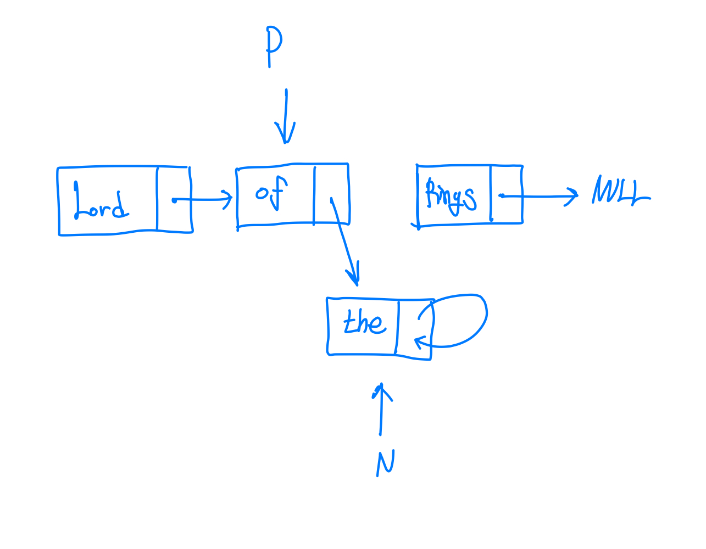
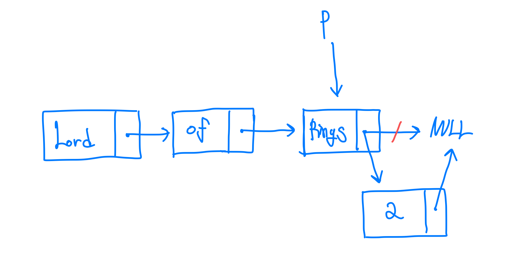

# Week 9

```
[1] 리스트 L에서 P가 가리키는 노드의 다음에 data="the" 인 노드를 삽입하는 슈도코드는 아래와 같다.

N ← alloc_node()
N->data ← “the”
N->link ← p->link
P->link ← N

(a) 리스트 L이 아래와 같고 P가 of 노드를 가리킬 때
L->Lord->of->Rings

만약 위 슈도코드의 네 라인 중 마지막 두 라인을 순서를 바꾸어 수행한다면
그 결과로 어떤 모습의 리스트를 얻게 되는지 그림으로 그리시오.

(b) 만약 P가 L의 맨 마지막 노드를 가리키는 경우에
그 마지막 노드의 다음에 data="2" 인 노드를 삽입하고자 한다면 위 슈도코드에서
N->data ← “the”를 N->data ← “2”로 수정한 코드를 쓰면 되는가?
아니면 추가적인 수정이 더 필요한가? 
-필요하다면 코드를 어떻게 수정? 
-불필요하다면 위 슈도코드에서 N->data ← “2”만 수정된 코드로 data=“2” 인 노드가 삽입되면서 리스트가 변경되어 가는 모습을 그림으로 데모
```

> (a)
> 
> 
> (b)
> 